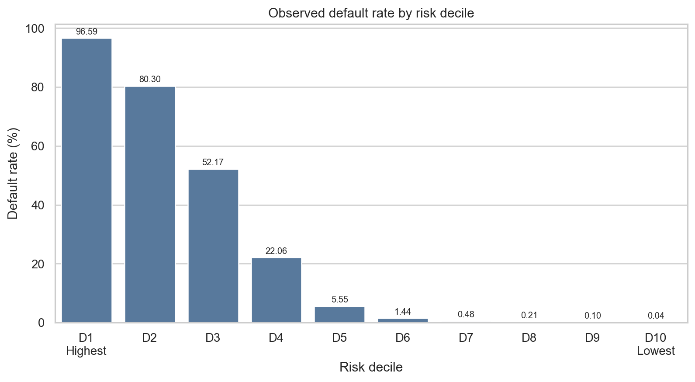
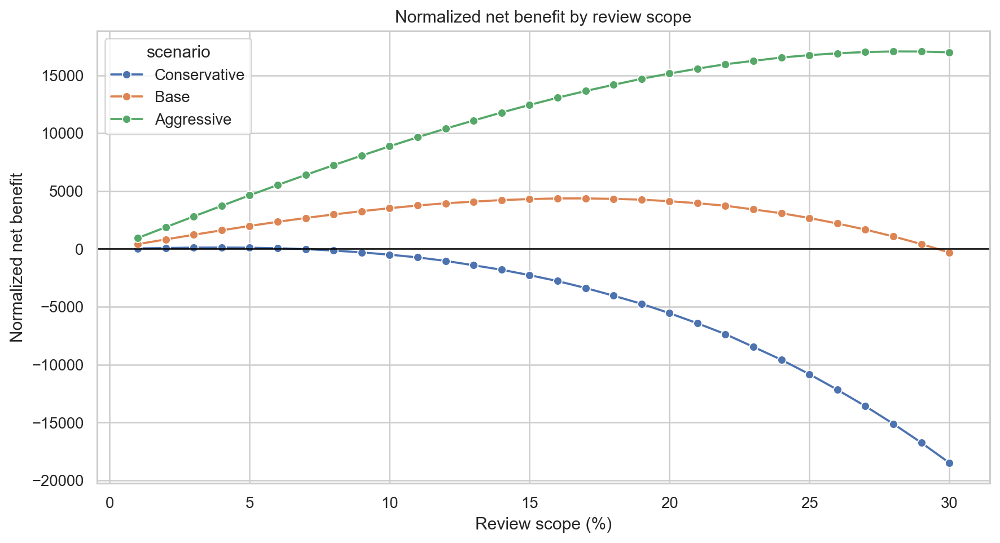

# AMEX Credit Risk Decisioning Portfolio

AMEX default prediction score를 manual review decisioning workflow로 바꾼 프로젝트입니다.

## Question

제한된 review capacity에서 어떤 고객을 먼저 검토해야 하는가?

## Key Results

- D1 default rate: **96.59%**
- D10 default rate: **0.04%**
- Base scenario best threshold: **Top 17%**
- Base normalized net benefit: **4,365.15**

## Notebook Flow

1. `01_preprocessing.ipynb`
   - customer-month to customer-level feature matrix
   - base, change, temporal, missing, categorical feature layers

2. `02_modeling.ipynb`
   - AMEX metric
   - LightGBM, XGBoost, CatBoost, MLP, meta model, equal blend
   - final score, rank, band

3. `03_validation.ipynb`
   - risk decile validation
   - risk band validation
   - cumulative default capture

4. `04_scenario.ipynb`
   - Top-K review policy
   - 20x non-default workload correction
   - normalized net benefit scenario

## Main Figures





## Structure

```text
amex-credit-risk-decisioning/
|-- README.md
|-- requirements.txt
|-- notebooks/
|   |-- 01_preprocessing.ipynb
|   |-- 02_modeling.ipynb
|   |-- 03_validation.ipynb
|   `-- 04_scenario.ipynb
|-- data/
|-- outputs/
|-- src/
`-- docs/
```

## Run

```powershell
python -m pip install -r requirements.txt

New-Item -ItemType Directory -Force -Path .tmp\.jupyter-runtime | Out-Null
$env:TEMP=(Resolve-Path .tmp).Path
$env:TMP=(Resolve-Path .tmp).Path
$env:TMPDIR=(Resolve-Path .tmp).Path
$env:JUPYTER_RUNTIME_DIR=(Resolve-Path .tmp\.jupyter-runtime).Path
$env:JUPYTER_ALLOW_INSECURE_WRITES='1'

$notebooks = @(
  "notebooks/01_preprocessing.ipynb",
  "notebooks/02_modeling.ipynb",
  "notebooks/03_validation.ipynb",
  "notebooks/04_scenario.ipynb"
)

foreach ($nb in $notebooks) {
  python -m nbconvert --log-level ERROR --to notebook --execute $nb --inplace
}
```

## Governance

Manual review prioritization과 monitoring을 위한 portfolio prototype입니다. 자동 거절 시스템이 아니며, production 적용 전 calibration, drift, fairness, compliance, audit logging 검증이 필요합니다.
