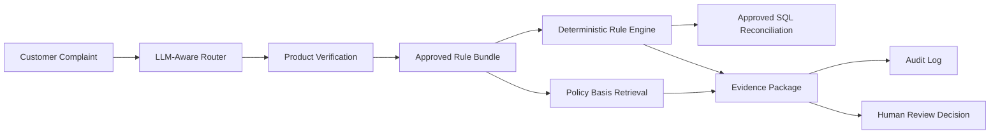

# Financial Recall Agent

<p align="center">
  <b>Safety-first LLM workflow for banking complaint investigation</b>
</p>

<p align="center">
  
  
  
  
  
</p>

Financial Recall Agent is a reference implementation for using LLMs in a high-risk financial workflow without giving the model unsafe authority.

The system investigates reward-missing banking complaints. An LLM-facing router can help identify the candidate harm type, but money movement, SQL execution, policy calculation, and customer-impacting decisions are handled by deterministic rule engines, approved assets, hash checks, data contracts, audit logs, and human review gates.

> Core idea: LLMs can help route and explain. They must not become the source of financial truth.

---

## Why This Project Exists

Financial complaint investigation is exactly the kind of workflow where LLMs are useful and dangerous at the same time.

Useful:

- Customer narratives are messy, multilingual, and ambiguous.
- Policy evidence can be hard to retrieve quickly.
- Reviewers need structured investigation packages, not raw ledgers.

Dangerous:

- An LLM should not generate production SQL.
- An LLM should not calculate refund amounts.
- An LLM should not override product policy.
- An LLM should not approve customer compensation.

This project demonstrates a safer pattern:

```text
LLM for routing and policy-basis assistance
Deterministic engines for financial calculation
Human review for customer-impacting action
```

---

## What It Does

Given one customer complaint, the system:

- Normalizes the complaint into a controlled investigation input.
- Routes it to an approved harm template.
- Verifies whether the customer has the relevant product.
- Loads an approved execution bundle.
- Verifies registry, product config, SQL, and data-contract hashes.
- Recalculates expected rewards from product policy.
- Reconciles expected rewards against reward ledger records.
- Retrieves policy basis records for reviewer context.
- Produces an evidence package and audit record.
- Blocks automatic refund approval.

The included demo focuses on `H07_REWARD_MISSING`, a synthetic Smart Cashback reward-missing scenario.

---

## Architecture



Runtime flow:

```text

src/recall_agent/application/
  complaint orchestration and public service API

src/recall_agent/core/
  bundle loading, hash verification, data contracts, rule execution

src/recall_agent/templates/reward_missing/
  H07 deterministic policy recalculation and reconciliation

data/demo/
  curated synthetic dataset and approved demo rule assets

sql/reward_missing/
  pre-approved SQL only
```

---

## LLM Trust Boundary

| Capability | Allowed? | Enforcement |
|---|---:|---|
| Recommend candidate harm type | Yes | Router schema and registered rule IDs |
| Retrieve policy basis | Yes | Registry-backed policy basis lookup |
| Generate SQL | No | Approved SQL files only |
| Calculate refund amount | No | Deterministic rule engine |
| Override product config | No | Approved bundle and config hash |
| Access private ground truth | No | Data contract and runtime controls |
| Approve compensation | No | Human review required |

This boundary is the point of the project. It treats the LLM as a useful assistant inside a controlled system, not as the authority over financial facts.

---

## Safety Controls

- Approved execution bundle only.
- SHA-256 verification for registry, product config, data contract, and SQL.
- Product config approval status validation.
- Data contract validation before execution.
- Free-form SQL disabled.
- Runtime path overrides disabled outside developer mode.
- Policy RAG restricted to evidence retrieval.
- Private ground-truth data prohibited at runtime.
- Append-only audit logging.
- Automatic refunds disabled.
- Human review required before customer action.

---

## Quick Start

### 1. Install dependencies

```powershell
py -3.12 -m venv .venv
.venv\Scripts\Activate.ps1
pip install -r requirements.txt
```

### 2. Run the core demo

```powershell
python -m src.recall_agent.interfaces.cli.h07_reward_missing_demo EVAL_BASE_0001 --json
```


### Smoke Test Result

The core CLI demo was verified locally with the following command:

```bash
python -m src.recall_agent.interfaces.cli.h07_reward_missing_demo EVAL_BASE_0001 --json
```

Representative result:

```text
complaint_id: EVAL_BASE_0001
rule_id: H07-REWARD-MISSING-TEMPLATE
rule_template_id: H07_REWARD_MISSING
product_config_id: JB_SMART_CASHBACK_CHECK__2022-07__v2
affected_customer_count: 44
unreported_customer_count: 43
total_harm_amount: 70030
decision_status: REQUIRES_HUMAN_CONFIRMATION
human_review_required: True
automatic_refund_allowed: False
used_private_ground_truth: False
llm_generated_sql: False
free_form_sql_allowed: False
```

This confirms that the demo identifies affected and unreported customers through the approved rule engine while keeping refund-related actions gated by human review. The LLM does not generate SQL, access private ground truth, or approve automatic refunds.

Expected output includes:

- selected rule template
- affected customer count
- unreported affected customer count
- estimated total harm
- policy basis records
- audit metadata
- human-review-required decision

### 3. Run tests

```powershell
py -3.12 -m pytest tests -q -p no:cacheprovider
```

Current local verification:

```text
34 passed
```


```powershell
```


---

## Demo Assets

| Asset | Path |
|---|---|
| Approved bundle | `data/demo/rules/bundles/h07_reward_missing_mvp.json` |
| Rule registry | `data/demo/rules/rule_registry.json` |
| Product config | `data/demo/rules/product_policy_configs/JB_SMART_CASHBACK_CHECK__2022-07__v2.json` |
| Data contract | `data/demo/rules/data_contracts/h07_synthetic_v3.json` |
| Policy basis registry | `data/demo/policy_rag/policy_basis_registry.jsonl` |
| Synthetic demo dataset | `data/demo/datasets/jb_h07_synthetic_dataset_v3` |
| Approved SQL | `sql/reward_missing` |

The demo data is synthetic and curated for reproducible local execution.

---

## Design Decisions

### 1. LLMs do not touch money

The LLM-facing layer can help route a complaint, but the refund-relevant facts come from approved data, approved SQL, and deterministic reconciliation.

### 2. Policy is versioned data, not prompt text

Product policy lives in structured config and is selected through an approved bundle. The model cannot rewrite or override it.

### 3. SQL is pre-approved and hash-verified

The runtime executes known SQL files whose hashes are recorded in the bundle. This prevents prompt-driven query generation from entering the financial path.

### 4. RAG retrieves evidence only

Policy basis retrieval is deliberately constrained. It provides review context; it does not determine harm, calculate compensation, or authorize action.

### 5. Human review is a product requirement

The system can assemble an evidence package, but it cannot approve a customer refund. The final action remains gated.

---

## Test Coverage

The test suite covers:

- Architecture contracts and plugin registration.
- Approved bundle and SQL hash verification.
- Product config governance.
- Data contract validation.
- Deterministic H07 reconciliation behavior.
- Policy basis retrieval constraints.
- Audit log generation.
- Submission structure and direct in-process service execution.

Representative command:

```powershell
py -3.12 -m pytest tests -q -p no:cacheprovider
```

---

## Repository Layout

```text
.
|-- data/demo/           # Curated demo assets and synthetic dataset
|-- docs/                # Portfolio review notes and implementation plans
|-- sql/                 # Approved SQL files
|-- src/                 # Application, core engine, policy retrieval, templates
|-- tests/               # Governance, contract, execution, and runtime-control tests
|-- requirements.txt
`-- README.md
```

---

## Limitations

- Uses a synthetic dataset, not live bank data.
- Policy basis records are demo evidence, not production legal documents.
- The UI is optional and intentionally secondary to the core workflow.
- No production banking systems are connected.
- This is a portfolio-grade reference implementation, not a deployable banking product.

---

## What This Demonstrates

This project is designed to show senior LLM engineering judgment:

- Knowing where an LLM is useful.
- Knowing where an LLM must be denied authority.
- Building deterministic verification around model-adjacent workflows.
- Treating auditability, data contracts, and human review as first-class system requirements.
- Making the system reproducible enough for local inspection.

The result is not another finance chatbot. It is a controlled financial investigation workflow where the LLM assists, the rule engine decides, and the human reviewer remains accountable.


### Smoke Test Result

The core CLI demo was verified locally with the following command:

```bash
python -m src.recall_agent.interfaces.cli.h07_reward_missing_demo EVAL_BASE_0001 --json
```

Representative result:

```text
complaint_id: EVAL_BASE_0001
rule_id: H07-REWARD-MISSING-TEMPLATE
rule_template_id: H07_REWARD_MISSING
product_config_id: JB_SMART_CASHBACK_CHECK__2022-07__v2
affected_customer_count: 44
unreported_customer_count: 43
total_harm_amount: 70030
decision_status: REQUIRES_HUMAN_CONFIRMATION
human_review_required: True
automatic_refund_allowed: False
used_private_ground_truth: False
llm_generated_sql: False
free_form_sql_allowed: False
```

This confirms that the demo identifies affected and unreported customers through the approved rule engine while keeping refund-related actions gated by human review. The LLM does not generate SQL, access private ground truth, or approve automatic refunds.
