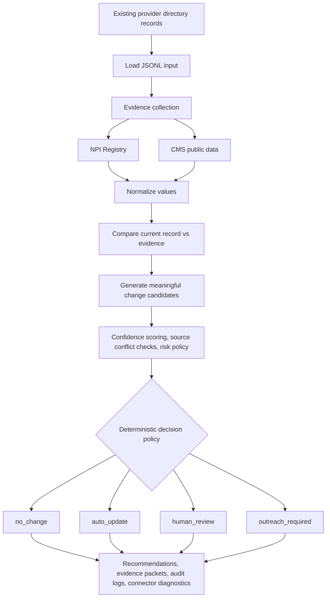

# Provider Directory Control Tower

Provider Directory Control Tower is an operating-mode MVP for validating existing provider directory records against NPI Registry and CMS public data. The default path runs with structured official-source evidence only: it accepts provider records, collects auditable source evidence, normalizes the evidence, proposes meaningful changes, scores confidence, and routes each record through a deterministic decision policy.

The recommendation engine can emit:

- `no_change`
- `auto_update`
- `human_review`
- `outreach_required`

## Core Flow



## Submission Positioning

- This project is a provider directory validation MVP centered on NPI Registry and CMS public data.
- The default execution path does not require fixture-based demo sources, search-engine dependencies, external page-fetching steps, LLM runtime options, or UI-specific tooling.
- The main operating flow is existing record input -> NPI/CMS evidence collection -> normalization -> meaningful change candidate generation -> confidence scoring -> deterministic decision policy -> `no_change` / `human_review` / `outreach_required` / `auto_update`.
- Final decisions are deterministic, based on normalization, source conflict checks, confidence thresholds, duplicate-NPI rules, and risk policy.
- Fixture-based demo evidence, search-engine crawling, direct site-fetching logic, optional LLM execution hooks, and the earlier UI wrapper were removed from the final submission.

## Project Layout

```text
provider_directory_control_tower/
  README.md
  requirements.txt
  run_pipeline.py
  configs/
    pipeline_config.json
  data/
    input/
      provider_records.jsonl
  outputs/
    .gitkeep
  sample_outputs/
    live_run/
  scripts/
    evaluate_pipeline.py
  src/
    cms.py
    confidence.py
    decision.py
    models.py
    normalize.py
    npi.py
    pipeline.py
    report.py
    repository.py
    sources.py
    utils.py
```

## Evidence Sources

### NPI Registry

The NPI Registry is the primary provider identity source. It is used for NPI validation, active status, provider name, primary taxonomy, practice location address, and practice location phone when a public record is available.

### CMS Public Data

CMS evidence is used for Medicare enrollment checks, provider or supplier risk signals, and confirmation or mismatch checks. CMS revoked-provider data is treated as a strong human-review signal. CMS FFS name and specialty evidence should confirm or flag mismatches rather than directly overwrite sensitive fields.

## Setup

```powershell
python -m venv .venv
.\.venv\Scripts\Activate.ps1
python -m pip install --upgrade pip
pip install -r requirements.txt
```

## Primary Run Command

This is the main submission-path command and runs with NPI Registry and CMS public data only.

```powershell
python run_pipeline.py `
  --input data\input\provider_records.jsonl `
  --use-real-npi `
  --use-cms `
  --cms-source minimal `
  --output-dir outputs\live_run
```

To regenerate the bundled sample results, run the same command and then move or copy `outputs\live_run` into `sample_outputs\live_run`.

Recommended CMS modes:

- `minimal`: Medicare FFS plus revoked provider or supplier checks. Best default for operating runs.
- `ffs`: Medicare FFS only.
- `revoked`: revoked provider or supplier checks only.
- `facility`: facility-oriented CMS datasets plus revoked checks.
- `all`: broader CMS sweep for small investigation runs.

## Sample Outputs

The portfolio sample run keeps these artifacts under `sample_outputs\live_run`:

- `executive_summary.md`
- `submission.csv`
- `recommendations.jsonl`
- `recommendations_pretty.json`
- `evidence_packets.jsonl`
- `audit_log.jsonl`
- `connector_diagnostics.csv`
- `connector_diagnostics.json`

## Evaluation Script

`scripts/evaluate_pipeline.py` remains in the repo as an explicit-input comparison utility. It is not part of the default NPI/CMS operating path and is not required to run the submission MVP.

## Future Work

A future version could add LLM-assisted web evidence extraction on top of the structured NPI/CMS pipeline, with an approved search API, explicit caching, and tighter quality controls. It is intentionally excluded from this submission build.

## Operating Policy

The system does not let an LLM make final provider directory decisions. The deterministic policy decides based on normalized values, reliable-source agreement, conflict detection, high-risk field rules, duplicate-NPI checks, confidence thresholds, and outreach or human-review fallbacks.