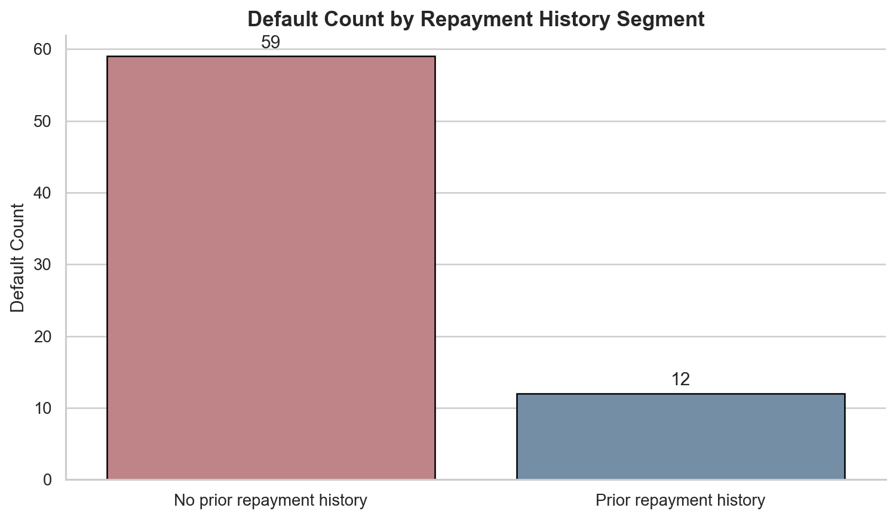
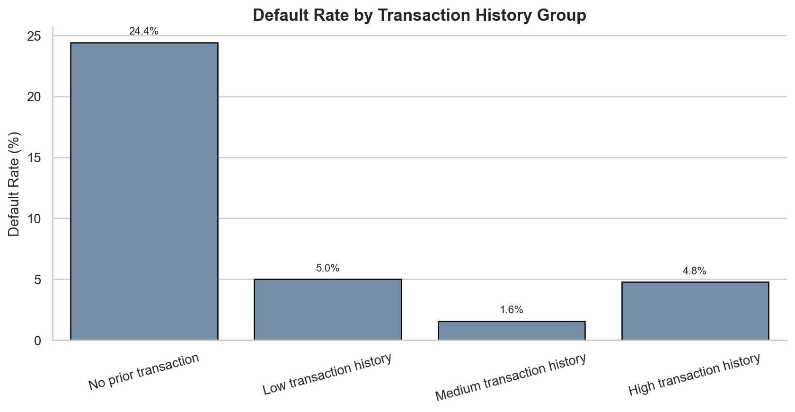
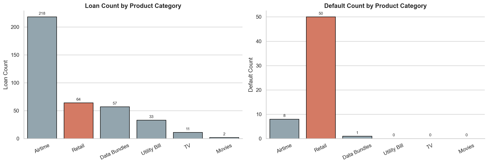
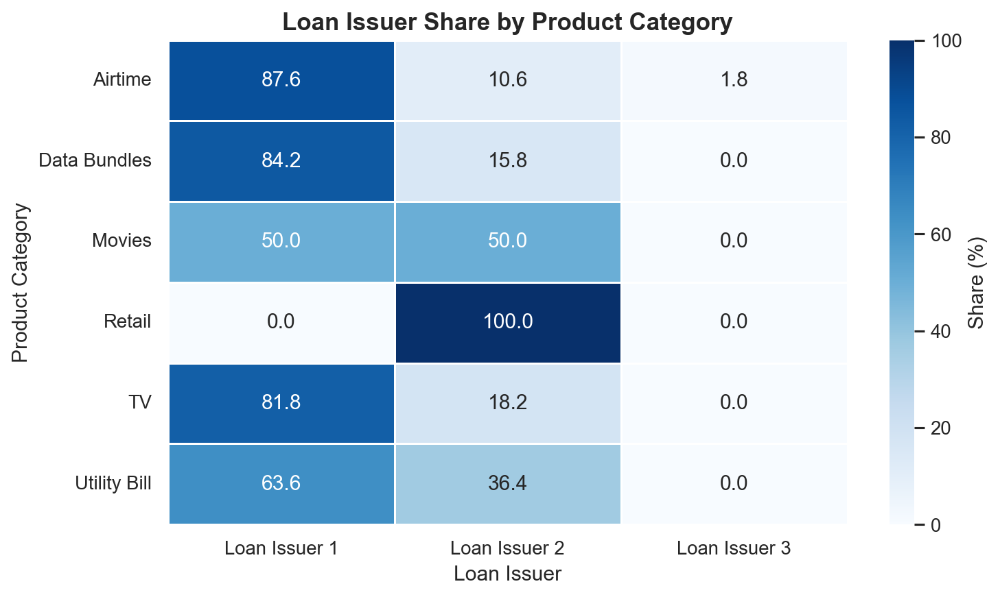
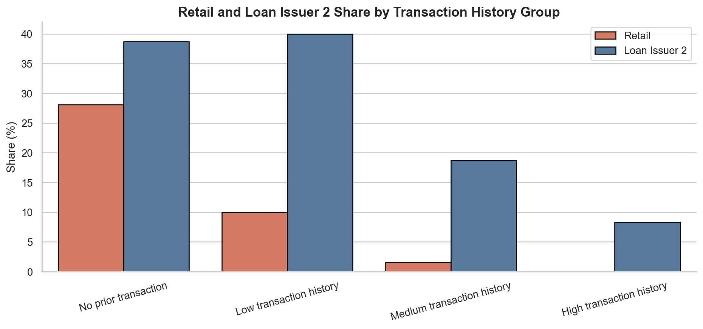
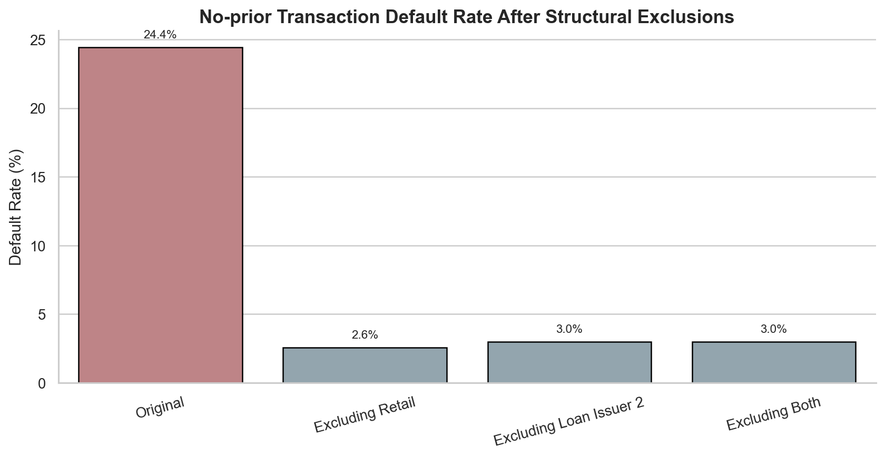
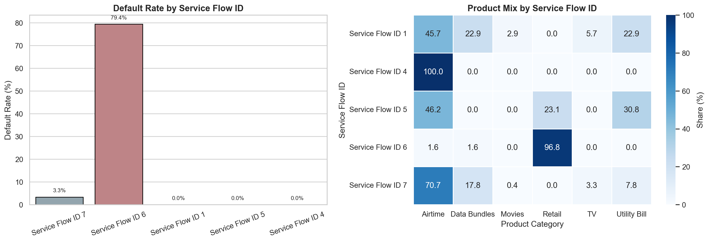
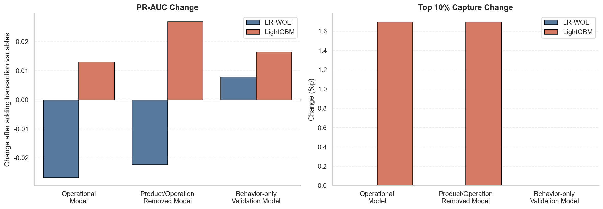
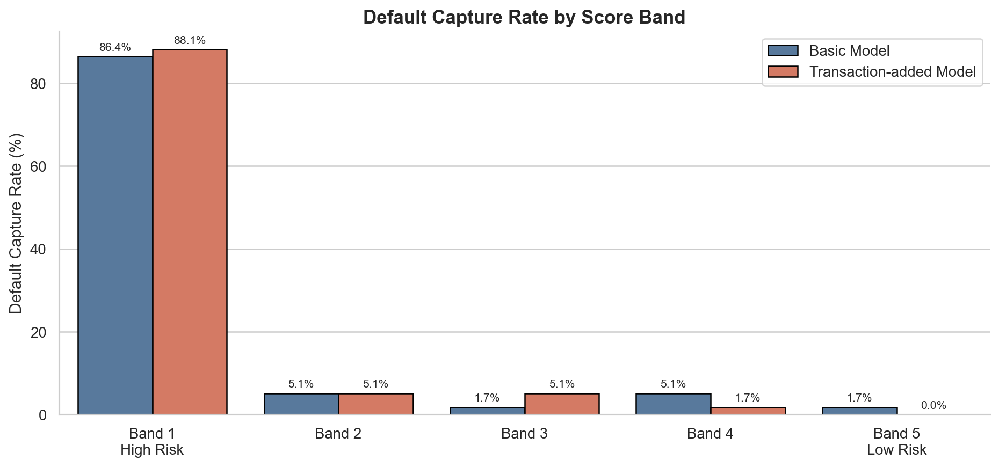

# 거래 이력이 없는 고객은 정말 위험할까?

Xente 데이터를 활용해 **상환 이력이 없는 고객의 신용위험 판단에서 대출 전 거래 행동 변수를 핵심 신용평가 변수로 채택할 수 있는지** 검증한 머신러닝/신용평가 분석 프로젝트입니다.

이 프로젝트는 단순히 “거래 이력이 없는 고객은 위험하다”는 결론을 내리지 않습니다. 거래 행동 신호가 실제 고객 위험을 설명하는지, 아니면 특정 상품군·대출 공급자·서비스 흐름 구조가 만들어낸 착시인지 EDA와 모델 검증을 통해 분리합니다.

---

## 1. Overview

핀테크 대출에서 상환 이력이 없는 고객은 판단하기 어렵습니다. 이 고객이 실제로 위험한 고객인지, 아니면 아직 판단할 데이터가 부족한 고객인지 구분하기 어렵기 때문입니다.

Xente는 우간다에서 결제, 쇼핑, 소액 대출·후불결제 서비스를 제공하는 전자상거래·금융 서비스입니다. 이 데이터에는 고객의 거래 이력과 대출 상환 결과가 함께 담겨 있습니다.

본 프로젝트의 핵심 질문은 다음과 같습니다.

> 상환 이력이 없는 고객의 대출 심사에서, 대출 전 거래 행동은 독립적인 신용위험 신호로 사용할 수 있는가?

분석 결과, 상환 이력이 없는 고객군은 전체 대출의 약 34%였지만 전체 미상환의 약 84.5%가 이 그룹에서 발생했습니다. 겉으로 보면 상환 이력이 없는 고객군은 매우 중요한 위험 관리 대상입니다.

그러나 더 깊게 보면, 거래 이력 없음 그룹의 높은 미상환율은 단순히 “거래 이력이 없어서 위험하다”는 의미가 아니었습니다. 리테일 상품군, 대출 공급자 2, 서비스 흐름 ID 6이 함께 몰려 있었고, 이 구조적 세그먼트에서 미상환이 집중되었습니다.

모델 검증에서도 거래 행동 변수를 추가했을 때 PR-AUC와 Top 10% Capture가 안정적으로 개선되지 않았습니다. 운영 적용 모델 기준으로 LR-WOE는 PR-AUC가 0.660에서 0.623으로 낮아졌고, LightGBM도 0.652에서 0.638로 낮아졌습니다.

따라서 이 프로젝트의 결론은 다음과 같습니다.

> 거래 행동 변수는 현재 데이터에서 핵심 신용평가 변수로 바로 채택하기 어렵다.  
> 대신 거래 행동은 보조 관찰 변수로 두고, 서비스 흐름 ID 6처럼 손실이 집중된 고위험 세그먼트를 우선 관리하는 것이 더 현실적이다.

---

## 2. Problem & Objective

상환 이력이 없는 고객을 지나치게 보수적으로 보면, 실제로는 갚을 수 있는 고객까지 놓칠 수 있습니다. 반대로 쉽게 승인하면 미상환 손실이 커질 수 있습니다.

따라서 이 문제는 단순히 “위험 고객을 거절한다”가 아니라, **위험 고객을 걸러내면서도 좋은 신규 고객을 놓치지 않는 판단 문제**입니다.

처음에는 대출 전 거래 행동이 이 판단을 보완할 수 있다고 보았습니다. 예를 들어 대출 전에도 플랫폼을 자주 이용하고, 최근까지 거래했으며, 거래 금액이 안정적인 고객이라면 상환 이력이 없어도 상대적으로 신뢰할 수 있을 수 있습니다.

하지만 거래 행동을 곧바로 신용위험 신호로 채택하면 위험합니다. 거래 이력이 없다는 사실이 실제 고객 행동 때문인지, 아니면 특정 상품군·대출 공급자·고액 거래·운영 구조가 섞인 결과인지 확인해야 하기 때문입니다.

이 프로젝트의 핵심 질문은 다음과 같습니다.

> 대출 전 거래 행동은 상환 이력이 없는 고객의 미상환 위험을 설명하는 독립적인 신호인가,  
> 아니면 특정 상품군·대출 공급자·서비스 흐름 구조의 대리 신호인가?

분석 목표는 세 가지입니다.

첫째, 전체 대출을 상환 이력 유무에 따라 나누고, 미상환이 어디에 집중되는지 확인합니다.

둘째, 상환 이력이 없는 고객군 안에서 거래 행동과 미상환율의 관계를 EDA로 확인합니다.

셋째, 상품군·대출 공급자·서비스 흐름 ID·금액·시간 정보를 고려한 뒤에도 거래 행동 변수가 모델 성능을 안정적으로 개선하는지 검증합니다.

---

## 3. Data

분석 단위는 고객 1명이 아니라 **대출 1건**입니다.

같은 고객이라도 대출 시점마다 이전 거래 이력과 상환 이력이 달라질 수 있기 때문입니다. 따라서 실제 심사 시점에 가까운 방식으로, 각 대출 건에 대해 대출 발행 이전에 알 수 있는 정보만 사용했습니다.

| 설계 기준 | 선택한 방식 | 이유 |
|---|---|---|
| 분석 단위 | 대출 1건 | 같은 고객도 대출 시점마다 거래 이력과 위험 조건이 달라질 수 있음 |
| 기준 시점 | 대출 발행 시점 | 실제 심사 시점에 알 수 있는 정보만 사용하기 위함 |
| 거래 이력 | 대출 이전 거래만 사용 | 대출 이후 거래를 사용하면 미래 정보 누수 발생 |
| 핵심 대상 | 상환 이력이 없는 고객군 | 기존 상환 기록만으로 판단하기 어려운 고객군 |

전체 대출은 1,153건입니다.

| 고객군 | 대출 건수 | 비중 |
|---|---:|---:|
| 상환 이력이 있는 고객군 | 757건 | 약 65.7% |
| 상환 이력이 없는 고객군 | 396건 | 약 34.3% |
| 전체 | 1,153건 | 100.0% |

전체 대출 규모만 보면 상환 이력이 있는 고객군이 더 많습니다. 하지만 미상환 발생 위치를 보면 양상이 달라집니다.

| 구분 | 미상환 건수 | 전체 미상환 내 비중 |
|---|---:|---:|
| 상환 이력이 있는 고객군 | 11건 | 약 15.5% |
| 상환 이력이 없는 고객군 | 60건 | 약 84.5% |
| 전체 | 71건 | 100.0% |

상환 이력이 없는 고객군은 전체 대출의 약 34%에 불과했지만, 전체 미상환의 약 84.5%가 이 그룹에서 발생했습니다.



이 그림은 왜 전체 고객을 한 번에 모델링하는 것만으로는 부족한지 보여줍니다. 전체 대출 건수 기준으로는 상환 이력이 있는 고객군이 더 크지만, 실제 손실은 상환 이력이 없는 고객군에 집중됩니다. 따라서 이후 분석은 상환 이력이 없는 고객군을 별도로 분리해 진행했습니다.

거래 행동 변수는 단순히 “거래 이력이 있는가?”만 보지 않았습니다. 실제 심사 판단에 보조 정보가 되려면 활동성, 최근성, 거래 안정성, 이용 폭을 나누어 봐야 한다고 판단했습니다.

| 판단 질문 | 관찰 지표 | 의사결정에서의 의미 |
|---|---|---|
| 대출 전 거래 이력이 있는가? | 거래 이력 유무, 거래 횟수 | 플랫폼 활동 여부 |
| 최근까지 이용했는가? | 마지막 거래 후 경과일 | 활동의 최근성 |
| 거래 규모가 안정적인가? | 평균 거래 금액, 금액 변동성 | 거래 패턴 안정성 |
| 다양한 상품군을 이용했는가? | 상품군·상품·공급자 다양성 | 플랫폼 이용 폭 |

이후 분석에서는 이 변수들이 미상환 위험을 구분하는지, 또는 특정 상품·대출 공급자·서비스 흐름 구조가 만들어낸 착시인지 단계적으로 확인했습니다.

---

## 4. Method / System Design

이 프로젝트의 분석 설계는 크게 두 단계로 나뉩니다.

첫 번째 단계는 EDA입니다. 상환 이력이 없는 고객군 안에서 거래 행동 구간별 미상환율을 확인하고, 그 패턴이 상품군·대출 공급자·서비스 흐름 ID와 어떻게 연결되는지 탐색했습니다.

두 번째 단계는 모델 검증입니다. EDA에서 유망해 보였던 거래 행동 변수가 실제로 모델 성능을 안정적으로 개선하는지 확인했습니다.

### 4.1 EDA 설계

EDA의 핵심은 “거래 행동이 미상환과 관련 있어 보인다”에서 멈추지 않는 것입니다.

먼저 거래 이력 구간별 미상환율을 확인했습니다. 이후 그 차이가 실제 고객 행동 때문인지, 특정 상품군이나 대출 공급 구조 때문인지 보기 위해 다음 순서로 분석했습니다.

| 단계 | 확인한 내용 | 목적 |
|---|---|---|
| 1 | 거래 이력 구간별 미상환율 | 거래 행동이 위험 신호처럼 보이는지 확인 |
| 2 | 상품군별 대출 건수와 미상환 건수 | 미상환이 특정 상품군에 집중되는지 확인 |
| 3 | 상품군과 대출 공급자 구조 | 리테일과 특정 공급자가 연결되어 있는지 확인 |
| 4 | 거래 이력별 구조적 세그먼트 비중 | 거래 이력 없음 그룹에 리테일·공급자 2가 몰려 있는지 확인 |
| 5 | 리테일/공급자 2 제외 후 미상환율 | 거래 이력 없음 자체의 신호가 남는지 확인 |
| 6 | 서비스 흐름 ID별 미상환율 | 실제 운영 관리 대상이 되는 고위험 흐름 확인 |

이 단계의 목적은 거래 행동 변수의 “겉보기 신호”와 “구조적 세그먼트 효과”를 분리하는 것입니다.

### 4.2 모델 검증 설계

EDA 이후 핵심 질문은 “거래 행동 변수가 미상환과 관련이 있는가?”가 아니었습니다. 더 중요한 질문은 다음이었습니다.

> 상품군·대출 공급자·서비스 흐름 ID·금액·시간 정보를 고려한 뒤에도 거래 행동 변수가 추가적인 위험 신호로 남는가?

이를 확인하기 위해 같은 모델끼리, 같은 검증 기준으로, 기본 모델과 거래 행동 추가 모델을 비교했습니다.

| 비교 원칙 | 설계 | 이유 |
|---|---|---|
| 같은 모델끼리 비교 | LR-WOE끼리, LightGBM끼리 비교 | 모델 차이와 feature 차이를 분리하기 위함 |
| 같은 검증 기준 사용 | Customer-level Stratified Group K-Fold | 같은 고객이 학습/검증에 동시에 들어가는 누수를 막기 위함 |
| 기본 모델 vs 거래 추가 모델 | Basic → Basic + Transaction | 거래 행동 변수의 추가 정보 가치를 확인하기 위함 |
| 해석 가능 모델 + 비선형 모델 | LR-WOE + LightGBM | 신용평가식 기준선과 비선형 구조를 함께 확인하기 위함 |

검증은 세 가지 track으로 나누었습니다.

| Track | 목적 | 포함/제외 정보 | 해석 |
|---|---|---|---|
| 운영 적용 모델 | 실제 심사 조건에 가까운 비교 | 상품군, 대출 공급자, 서비스 흐름 ID, 금액, 시간 포함 | 운영 정보 위에 거래 행동이 추가로 도움이 되는지 확인 |
| 상품·운영 요인 소거 모델 | 상품·공급자 영향 제거 | 상품군, 대출 공급자 제외 | 거래 행동이 상품·공급자 구조의 대리 신호인지 확인 |
| 행동 변수 단독 검증 모델 | 금액 변수까지 제거 | 상품군, 대출 공급자, 금액 제외 | 더 강한 조건에서도 거래 행동 신호가 남는지 확인 |

평가는 단순 accuracy보다 미상환 고객을 얼마나 잘 위험 상위 구간에 올리는지에 초점을 두었습니다.

| 평가 기준 | 왜 보았는가 | 채택 판단에서의 의미 |
|---|---|---|
| PR-AUC | 미상환 건수가 적어 Accuracy는 부적절함 | 미상환 고객을 얼마나 잘 구분하는지 확인 |
| Top 10% Capture | 실제 심사에서는 상위 위험군을 우선 관리함 | 가장 위험하다고 본 구간에 미상환이 얼마나 모이는지 확인 |
| Score Band | 점수가 실제 위험 순서를 만드는지 확인 | High-risk 구간일수록 미상환율이 높아야 함 |
| Group Permutation | feature importance만으로 성능 기여를 판단하기 어려움 | 거래 변수 묶음을 섞었을 때 실제 성능이 떨어지는지 확인 |

---

## 5. Implementation

이 프로젝트는 EDA, feature generation, model validation, permutation analysis, score band analysis를 분리해 구현하는 것을 목표로 합니다.

전체 파이프라인은 다음과 같습니다.

1. 원자료에서 대출 1건 단위 테이블을 구성합니다.
2. 각 대출 건에 대해 대출 발행 이전 거래만 집계합니다.
3. 상환 이력 유무를 기준으로 고객군을 분리합니다.
4. 상환 이력이 없는 고객군을 중심으로 EDA를 수행합니다.
5. 상품군·대출 공급자·서비스 흐름 ID와 거래 행동 변수의 얽힘을 확인합니다.
6. 기본 feature set과 거래 행동 추가 feature set을 구성합니다.
7. LR-WOE와 LightGBM으로 모델 비교를 수행합니다.
8. Customer-level Stratified Group K-Fold로 검증합니다.
9. PR-AUC, Top 10% Capture, Score Band를 계산합니다.
10. Group Permutation으로 변수군의 실제 성능 기여를 확인합니다.

결과물은 크게 두 종류입니다.

| 결과물 | 저장 위치 | 역할 |
|---|---|---|
| EDA 그림 | `outputs/figures/` | 구조적 착시와 고위험 세그먼트 설명 |
| 모델 결과표 | `outputs/tables/` | Basic vs Transaction 성능 비교 및 검증 결과 |

---

## 6. Evaluation

검증 결과, 거래 행동 변수 추가는 안정적인 성능 개선을 만들지 못했습니다.

이 프로젝트의 Evaluation은 그림과 표를 함께 보면서 다음 흐름으로 읽으면 됩니다.

1. 거래 이력 없음은 처음에는 강한 위험 신호처럼 보였습니다.
2. 그러나 그 신호는 리테일·대출 공급자 2·서비스 흐름 ID 6과 강하게 얽혀 있었습니다.
3. 모델에 거래 행동 변수를 추가해도 성능은 안정적으로 개선되지 않았습니다.
4. 실제 고위험 구간 포착력도 개선되지 않았습니다.

---

### 6.1 거래 이력 없음은 처음에는 강한 위험 신호처럼 보였다

상환 이력이 없는 고객군 안에서 거래 이력 구간별 미상환율을 확인하면, 거래 이력 없음 그룹이 가장 위험해 보입니다.

| 거래 이력 구간 | 미상환율 | 해석 |
|---|---:|---|
| 거래 이력 없음 | 23.6% | 가장 높은 위험 구간처럼 보임 |
| 거래 이력 낮음 | 약 5%대 | 낮은 미상환율 |
| 거래 이력 중간 | 약 5%대 | 낮은 미상환율 |
| 거래 이력 높음 | 0.0% | 미상환 없음 |



이 그림만 보면 거래 행동은 상환 이력이 없는 고객의 위험을 설명하는 유망한 신호처럼 보입니다. 거래 이력이 없는 고객군의 미상환율이 가장 높고, 거래 이력이 높은 그룹에서는 미상환이 관찰되지 않기 때문입니다.

하지만 이 단계에서 바로 “거래 이력이 없으면 위험하다”고 결론 내리면 안 됩니다. 거래 이력 없음 그룹 안에 특정 상품군, 대출 공급자, 서비스 흐름이 함께 몰려 있을 수 있기 때문입니다.

---

### 6.2 미상환은 리테일 상품군에 집중되어 있었다

다음으로 상품군별 전체 대출 건수와 미상환 건수를 비교했습니다.

전체 대출 건수만 보면 통신요금 상품군이 가장 많았지만, 미상환은 리테일 상품군에 크게 집중되어 있었습니다.



이 그림은 중요한 해석 전환점을 만듭니다. 거래 이력 없음 그룹의 높은 미상환율을 고객 행동만으로 설명하기 전에, 미상환이 특정 상품군에 비정상적으로 집중되어 있는지 확인해야 합니다.

즉, “거래 이력이 없어서 위험하다”가 아니라 “거래 이력이 없는 고객군에 리테일 대출이 많이 포함되어 있어서 위험해 보인다”는 가능성을 검토해야 합니다.

---

### 6.3 리테일은 특정 대출 공급자와 강하게 연결되어 있었다

리테일의 높은 미상환율이 단순 상품군 효과인지 확인하기 위해, 상품군과 대출 공급자 구조를 함께 확인했습니다.



그 결과 리테일은 대출 공급자 2와 강하게 연결되어 있었습니다.

이 지점에서 거래 행동 변수의 해석은 더 조심스러워집니다. 거래 이력 없음 그룹이 단순히 “플랫폼 이용 경험이 없는 고객”만을 의미하는 것이 아니라, 특정 상품군과 특정 대출 공급 구조가 함께 섞인 그룹일 수 있기 때문입니다.

---

### 6.4 거래 이력 없음 그룹에는 구조적 고위험 세그먼트가 몰려 있었다

거래 이력별로 리테일과 대출 공급자 2의 비중을 확인했습니다.



이 그림은 거래 이력 없음 그룹 안에 리테일과 대출 공급자 2가 상대적으로 많이 포함되어 있음을 보여줍니다.

따라서 거래 이력별 미상환율 차이는 고객의 플랫폼 이용 행동만으로 설명되지 않을 수 있습니다. 거래 이력 없음 그룹은 단순히 거래가 없는 고객군이 아니라, 특정 상품군과 대출 공급 구조가 함께 섞인 고객군일 가능성이 있었습니다.

---

### 6.5 구조적 세그먼트를 제외하면 거래 이력 없음의 위험 신호는 크게 약해졌다

이 의심을 확인하기 위해 리테일과 대출 공급자 2를 제외한 뒤, 거래 이력 없음 그룹의 미상환율을 다시 확인했습니다.

| 조건 | 거래 이력 없음 그룹 미상환율 | 해석 |
|---|---:|---|
| 전체 기준 | 23.6% | 거래 이력 없음이 위험해 보임 |
| 리테일 제외 | 2.4% | 리테일 집중을 제거하면 위험 신호가 크게 약해짐 |
| 대출 공급자 2 제외 | 2.9% | 공급자 구조를 제거해도 위험 신호가 크게 약해짐 |



이 결과는 이 프로젝트의 핵심입니다.

거래 이력 없음의 높은 미상환율은 거래 행동 자체의 독립적인 위험 신호라기보다, 리테일·대출 공급자 2 같은 구조적 세그먼트가 함께 섞인 결과일 가능성이 큽니다.

따라서 거래 행동 변수를 신용평가 핵심 변수로 채택하기 전에, 상품군과 운영 구조의 영향을 반드시 분리해야 합니다.

---

### 6.6 서비스 흐름 ID 6이 실제 고위험 구간이었다

구조 ID는 원본 정의가 포괄적이어서 정확한 내부 의미를 단정하기 어렵습니다. 따라서 본 분석에서는 이를 상품군·대출 공급자·이용 흐름이 결합된 서비스 흐름 ID로 해석했습니다.

서비스 흐름 ID별 상품군 구성과 미상환 집중도를 확인한 결과, ID 6에서 미상환이 비정상적으로 집중되었습니다.

| 서비스 흐름 ID | 전체 건수 | 리테일 건수 | 미상환 건수 | 미상환율 | 해석 |
|---|---:|---:|---:|---:|---|
| ID 6 | 63건 | 61건 | 50건 | 79.4% | 리테일과 미상환이 강하게 집중된 고위험 흐름 |
| ID 7 | 280건 | - | 10건 | 약 3.6% | 대출 건수는 많지만 미상환 집중은 낮음 |



이 결과는 운영 판단을 바꿉니다.

문제는 “거래 이력 없는 고객 전체”가 아니라, **서비스 흐름 ID 6으로 대표되는 고위험 구조**였습니다. 따라서 거래 이력 없음 고객을 일괄적으로 위험 처리하기보다, 손실이 집중된 서비스 흐름을 우선 관리하는 것이 더 현실적입니다.

---

### 6.7 거래 행동 변수 추가는 모델 성능을 안정적으로 개선하지 못했다

EDA 이후에는 거래 행동 변수가 실제 모델 성능을 개선하는지 확인했습니다.

운영 적용 모델에서는 실제 심사 조건에 가까운 정보, 즉 상품군, 대출 공급자, 서비스 흐름 ID, 금액, 시간 정보를 포함한 상태에서 거래 행동 변수를 추가했습니다.

| 모델 | Feature Set | PR-AUC | Top 10% Capture | 상위 10% 포착 미상환 수 | 해석 |
|---|---|---:|---:|---:|---|
| LR-WOE | Basic | 0.660 | 51.7% | 31명 / 60명 | 기준 모델 |
| LR-WOE | Basic + Transaction | 0.623 | 50.0% | 30명 / 60명 | 거래 변수 추가 후 성능 하락 |
| LightGBM | Basic | 0.652 | 50.0% | 30명 / 60명 | 기준 모델 |
| LightGBM | Basic + Transaction | 0.638 | 48.3% | 29명 / 60명 | 거래 변수 추가 후 성능 하락 |



수십 개의 거래 행동 변수를 추가했지만, 운영 적용 모델에서는 PR-AUC와 Top 10% Capture가 모두 개선되지 않았습니다.

상위 10% 위험군에서 실제 미상환자를 얼마나 잡았는지 보면 차이는 더 직관적입니다. LR-WOE 기준으로는 31명에서 30명으로 줄었고, LightGBM 기준으로는 30명에서 29명으로 줄었습니다.

즉, 거래 행동 변수는 실제 운영에서 중요한 “상위 위험군 포착력”을 개선하지 못했습니다.

---

### 6.8 Permutation 검증에서도 거래 행동의 기여는 작았다

모델의 feature importance만 보면 거래 행동 변수가 중요해 보일 수 있습니다. 하지만 실제로 그 변수군을 섞었을 때 성능이 얼마나 떨어지는지 확인해야 합니다.

Group Permutation 결과는 다음과 같았습니다.

| 검증 조건 | 변수군 | PR-AUC 손실 | 해석 |
|---|---|---:|---|
| 운영 적용 모델 | 금액 변수군 | 0.312 | 가장 큰 성능 기여 |
| 운영 적용 모델 | 거래 행동 활동성·최근성·횟수 변수군 | 약 0.001 | 성능 기여가 거의 없음 |
| 상품·운영 요인 소거 모델 | 금액 변수군 | 0.206 | 여전히 큰 성능 기여 |
| 상품·운영 요인 소거 모델 | 시간·서비스 흐름 ID 계열 변수군 | 0.197 | 구조적 흐름 정보가 중요 |
| 상품·운영 요인 소거 모델 | 거래 행동 변수군 | 작거나 음수 | 안정적인 성능 기여 없음 |

이 결과는 모델의 위험 순서를 실질적으로 지탱한 신호가 거래 행동보다 금액, 시간, 서비스 흐름 ID 계열 변수에 가까웠다는 점을 보여줍니다.

즉, 거래 행동 변수는 EDA에서 유망해 보였지만, 실제 모델 성능에 독립적으로 기여한 핵심 변수군은 아니었습니다.

---

### 6.9 Score Band에서도 고위험 구간 포착력은 개선되지 않았다

실제 운영에서는 전체 점수 성능보다 상위 위험 구간이 중요합니다. 심사팀은 모든 고객을 동일하게 보지 않고, 위험 점수가 높은 구간을 우선 검토하기 때문입니다.

점수 구간별로 확인했을 때, 기본 모델은 가장 높은 위험 구간에서 전체 미상환의 83.3%를 포착했습니다. 거래 변수 추가 모델도 같은 구간에서 83.3%를 포착했습니다.

| 모델 | 최고 위험 구간 미상환 포착률 | 해석 |
|---|---:|---|
| Basic | 83.3% | 고위험 구간에서 대부분의 미상환 포착 |
| Basic + Transaction | 83.3% | 거래 행동 변수 추가 후 개선 없음 |



즉, 거래 행동 변수를 추가해도 실제 운영에서 중요한 고위험 구간의 미상환 포착력은 개선되지 않았습니다.

결론적으로, 거래 행동 변수는 EDA 단계에서는 유망해 보였지만 현재 데이터에서는 핵심 신용평가 변수로 채택할 만큼의 안정적인 추가 가치를 확인하기 어려웠습니다.

---

## 7. Key Design Decisions

### 왜 고객 단위가 아니라 대출 1건 단위로 분석했는가?

같은 고객이라도 대출 시점마다 이전 거래 이력과 상환 이력이 달라질 수 있습니다.

신용평가에서 중요한 것은 “이 고객이 과거에 어떤 사람이었는가”만이 아니라, 특정 대출 신청 시점에 어떤 정보가 관찰 가능했는가입니다. 따라서 분석 단위를 고객이 아니라 대출 1건으로 설정했습니다.

### 왜 대출 이전 거래만 사용했는가?

대출 이후 거래를 feature로 사용하면 미래 정보 누수가 발생합니다.

실제 심사 시점에서는 대출 이후의 거래를 알 수 없습니다. 따라서 모든 거래 행동 변수는 대출 발행 이전 거래만 사용해 구성했습니다.

### 왜 상환 이력이 없는 고객군을 따로 분리했는가?

전체 미상환 71건 중 60건, 약 84.5%가 상환 이력이 없는 고객군에서 발생했습니다.

전체 모델에서 이 그룹을 섞어 보면, 상환 이력이라는 강한 정보가 다른 신호를 가릴 수 있습니다. 그래서 상환 이력이 없는 고객군을 따로 분리해, 이 그룹 안에서 거래 행동이 추가적인 판단 정보를 제공하는지 확인했습니다.

### 왜 EDA에서 바로 결론 내리지 않았는가?

거래 이력 없음 그룹의 미상환율은 23.6%로 높았습니다. 하지만 이 그룹에는 리테일, 대출 공급자 2, 서비스 흐름 ID 6이 함께 몰려 있었습니다.

따라서 거래 이력 없음이 실제 위험 신호인지, 아니면 구조적 세그먼트의 대리 신호인지 분리해야 했습니다.

### 왜 같은 모델끼리 비교했는가?

거래 행동 변수의 추가 가치를 보려면 모델 차이와 feature 차이를 분리해야 합니다.

LR-WOE와 LightGBM을 서로 비교하면 모델 구조 차이가 섞입니다. 그래서 LR-WOE는 LR-WOE끼리, LightGBM은 LightGBM끼리 Basic과 Basic + Transaction을 비교했습니다.

### 왜 Customer-level Group K-Fold를 사용했는가?

같은 고객이 여러 대출을 가질 수 있습니다. 같은 고객의 대출이 학습과 검증에 동시에 들어가면 모델이 고객 특성을 기억하는 누수가 생길 수 있습니다.

이를 막기 위해 고객 단위로 fold를 나누는 Stratified Group K-Fold를 사용했습니다.

### 왜 PR-AUC와 Top 10% Capture를 사용했는가?

미상환 건수가 적기 때문에 Accuracy는 적절하지 않습니다. 대부분을 정상 상환으로 예측해도 정확도는 높아 보일 수 있습니다.

실제 운영에서는 위험 상위 구간을 우선 검토하므로, PR-AUC와 Top 10% Capture가 더 중요합니다.

---

## 8. Development Notes

이 프로젝트는 처음에는 “거래 이력이 없는 고객은 위험한가?”라는 질문에서 출발했습니다.

초기 EDA에서는 거래 이력 없음 그룹의 미상환율이 23.6%로 가장 높았고, 거래 이력이 높은 그룹에서는 미상환이 0%였습니다. 이 결과만 보면 거래 행동 변수는 매우 유망해 보였습니다.

하지만 상품군별로 미상환을 나누어 보면서 해석이 바뀌었습니다. 전체 대출 건수는 통신요금 상품군이 많았지만, 미상환은 리테일에 집중되어 있었습니다.

다음으로 리테일과 대출 공급자 2가 강하게 연결되어 있음을 확인했습니다. 거래 이력 없음 그룹에는 리테일과 대출 공급자 2가 많이 포함되어 있었고, 거래 이력이 높은 그룹에서는 거의 나타나지 않았습니다.

리테일을 제외하자 거래 이력 없음 그룹의 미상환율은 23.6%에서 2.4%로 낮아졌습니다. 대출 공급자 2를 제외해도 2.9% 수준으로 낮아졌습니다.

가장 큰 전환점은 서비스 흐름 ID 6이었습니다. 서비스 흐름 ID 6은 전체 63건 중 61건이 리테일이었고, 63건 중 50건이 미상환이었습니다. 미상환율은 79.4%였습니다. 반면 대출 건수가 가장 많은 서비스 흐름 ID 7은 280건 중 10건만 미상환이었습니다.

이 과정을 통해 질문이 바뀌었습니다.

처음 질문은 다음과 같았습니다.

> 거래 이력이 없는 고객은 위험한가?

최종 질문은 다음이 되었습니다.

> 거래 행동 변수는 리테일·대출 공급자·서비스 흐름 구조를 고려한 뒤에도 독립적인 신용위험 신호로 남는가?

모델 검증 결과, 거래 행동 변수 추가는 안정적인 성능 개선을 만들지 못했습니다. 그래서 최종 결론은 거래 행동 변수 채택이 아니라, 고위험 서비스 흐름을 우선 관리하는 방향으로 정리되었습니다.

---

## 9. Limitations

이 프로젝트는 공개 데이터 기반 분석이므로 몇 가지 한계가 있습니다.

첫째, 서비스 흐름 ID의 실제 내부 의미를 확인할 수 없습니다. 본문에서는 이를 상품군·대출 공급자·이용 흐름이 결합된 서비스 흐름 ID로 해석했지만, 실제로는 상품 정책, 구독 단위, 후불결제 흐름, 운영 캠페인 등 여러 가능성이 있습니다.

둘째, 전체 미상환 건수는 71건이고, 상환 이력이 없는 고객군의 미상환 건수는 60건입니다. 표본이 작기 때문에 일부 성능 차이는 데이터 분할이나 표본 구성에 따라 흔들릴 수 있습니다.

셋째, 거래 행동 변수는 현재 데이터 안에서만 검증되었습니다. 다른 기간, 다른 상품군, 다른 대출 정책에서는 결과가 달라질 수 있습니다.

넷째, 외부 신용정보나 본인인증 수준 같은 중요한 정보가 포함되어 있지 않습니다. 실제 신용평가에서는 내부 거래 행동뿐 아니라 외부 신용정보와 신원 확인 수준이 함께 필요할 수 있습니다.

다섯째, 이 분석은 정책 실험이 아닙니다. 거래 행동 변수를 채택했을 때 실제 승인율, 손실률, 고객 유입이 어떻게 바뀌는지는 별도의 운영 실험으로 확인해야 합니다.

따라서 현재 데이터에서는 거래 행동 변수를 핵심 신용평가 변수로 바로 채택하기보다, 보조 관찰 변수로 두고 고위험 서비스 흐름을 우선 관리하는 것이 더 현실적인 판단입니다.

---

## 10. How to Run

### Install dependencies

```bash
pip install -r requirements.txt
```

### Run the full pipeline

```bash
PYTHONPATH=$PWD:$PYTHONPATH python scripts/run_all.py
```

### Run each step separately

```bash
PYTHONPATH=$PWD:$PYTHONPATH python scripts/00_prepare_loan_level_table.py
PYTHONPATH=$PWD:$PYTHONPATH python scripts/01_eda_no_repayment_history.py
PYTHONPATH=$PWD:$PYTHONPATH python scripts/02_eda_structural_confounding.py
PYTHONPATH=$PWD:$PYTHONPATH python scripts/03_train_operational_models.py
PYTHONPATH=$PWD:$PYTHONPATH python scripts/04_ablation_models.py
PYTHONPATH=$PWD:$PYTHONPATH python scripts/05_group_permutation.py
PYTHONPATH=$PWD:$PYTHONPATH python scripts/06_score_band_analysis.py
```

실행 결과는 `outputs/` 폴더에 저장됩니다.

EDA 그림은 `outputs/figures/`에 저장하고, 모델 결과표는 `outputs/tables/`에 저장하는 구조를 권장합니다.

---

## 11. Project Structure

```text
xente-credit-feature-adoption/
├── README.md
├── requirements.txt
├── data/
│   ├── raw/
│   └── processed/
├── notebooks/
│   ├── 01_eda_transaction_history.ipynb
│   ├── 02_structural_confounding_checks.ipynb
│   ├── 03_model_validation.ipynb
│   └── 04_operational_decision.ipynb
├── scripts/
│   ├── 00_prepare_loan_level_table.py
│   ├── 01_eda_no_repayment_history.py
│   ├── 02_eda_structural_confounding.py
│   ├── 03_train_operational_models.py
│   ├── 04_ablation_models.py
│   ├── 05_group_permutation.py
│   ├── 06_score_band_analysis.py
│   └── run_all.py
├── src/
│   └── xente_credit/
│       ├── features.py
│       ├── validation.py
│       ├── metrics.py
│       └── plotting.py
└── outputs/
    ├── figures/
    └── tables/
```

실제 저장소 구조가 다르면 위 구조는 현재 폴더명에 맞게 수정하면 됩니다.

중요한 것은 README에서 EDA 그림, 모델 결과표, permutation 결과, score band 결과가 어디에 저장되는지 명확히 연결하는 것입니다.

---

## 12. What This Project Demonstrates

이 프로젝트는 거래 행동 변수를 신용평가 모델에 추가할지 판단하는 feature adoption 분석입니다.

첫째, 단순히 예측 성능이 높아 보이는 변수를 바로 채택하지 않고, 그 변수가 실제 고객 위험을 설명하는지 구조적 착시인지 확인했습니다.

둘째, 대출 1건 단위로 기준 시점을 맞추고, 대출 이전 거래만 사용해 미래 정보 누수를 방지했습니다.

셋째, 상환 이력이 없는 고객군을 따로 분리해, 실제로 판단이 어려운 고객군에서 거래 행동의 추가 가치를 검증했습니다.

넷째, EDA를 통해 거래 이력 없음 그룹의 높은 미상환율이 리테일·대출 공급자 2·서비스 흐름 ID 6과 강하게 얽혀 있음을 확인했습니다.

다섯째, LR-WOE와 LightGBM을 같은 조건에서 비교해 거래 행동 변수의 추가 성능 기여를 검증했습니다.

여섯째, Customer-level Stratified Group K-Fold를 사용해 같은 고객이 학습과 검증에 동시에 들어가는 누수를 막았습니다.

일곱째, PR-AUC, Top 10% Capture, Score Band, Group Permutation을 사용해 실제 운영에서 중요한 위험 상위 구간 포착력을 평가했습니다.

마지막으로, 거래 행동 변수를 핵심 신용평가 변수로 바로 채택하지 않고, 고위험 서비스 흐름을 우선 관리하는 운영 판단으로 연결했습니다.

이 프로젝트의 핵심은 단순히 모델을 학습한 것이 아니라, **좋아 보이는 feature를 실제 신용평가 변수로 채택해도 되는지 검증하고, 채택하지 않는 판단까지 데이터로 설명한 것**입니다.
